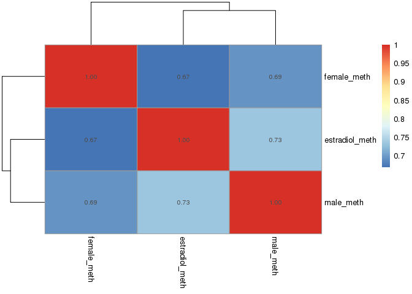

# Processing DNA Methylation Data

# Processing and sanity checking DNA methylation data

Warning, the data files come out to be 2.5 GB! Check that your computer has more than 2.5 GB of RAM, or else your computer will crash!

## Load libraries


```r
require(data.table)
require(foreach)
require(doMC)
require(knitr)
# opts_knit$set(root.dir = '../..')
require(dplyr)
require(ggplot2)
require(pheatmap)
```

## Load data


```r
cpg_file_names <- dir("../methylation_data/", "*.CG.bed", full.names = T)

registerDoMC(9)
cpg_files <- foreach(x=cpg_file_names, .combine = c) %dopar% {
  tmp <- fread(input = x) %>% 
    setnames(c("chr","pos","end","converted_C","cov")) %>% 
    filter(chr != "chrMT") %>%
    mutate(meth = (converted_C/cov) %>% round(3)) %>%
    select(-end, -converted_C)
  list(tmp)
}

file_table <- read.delim("../methylation_data/sample_table.txt", header = FALSE) %>% arrange(V1)

names(cpg_files) <- file_table$V2
```


```r
all_cpgs <- rbindlist(cpg_files) %>% select(chr, pos) %>% unique()

cpg_files_merged <- foreach(i=1:length(cpg_files), .combine = cbind) %dopar% {
  file_name <- names(cpg_files)[[i]]
  left_join(all_cpgs, cpg_files[[i]]) %>%
    select(meth, cov) %>%
    setnames(paste0(file_name, c("_meth", "_cov")))
}

cpg_files_merged <- cbind(all_cpgs, cpg_files_merged)

# save("cpg_files_merged", file = "methylation_data/methylation_data.RData", compress = TRUE)
```

## Analysis begins

### Number of CpGs

#### Per sample


```r
lapply(cpg_files, nrow) %>% data.frame() %>% t() %>% data.frame() %>% add_rownames()
```

```
## Source: local data frame [9 x 2]
## 
##      rowname        .
##        (chr)    (int)
## 1    female1  8924132
## 2    female2  8703590
## 3    female3 13634545
## 4 estradiol1 13813794
## 5 estradiol2 14180700
## 6 estradiol3 16629552
## 7      male1 18060763
## 8      male2 15175856
## 9      male3 17691011
```

#### Per chromosome per sample


```r
cpg_per_chrom_per_sample <- foreach(i=1:length(cpg_files), .combine = rbind) %dopar%{
  cpg_files[[i]] %>% group_by(chr) %>% tally() %>% mutate(sample = names(cpg_files)[i])
} 

cpg_per_chrom_per_sample %>% 
  mutate(facet = gsub("[1-3]", "", sample),
         chr = factor(chr, levels = paste0("chr", c(1:20, "X", "Y")))) %>%
  ggplot(aes(chr, n, color = facet, group = sample)) +
  # facet_wrap(~facet) +
  geom_line() +
  theme(axis.text.x = element_text(angle = 90, hjust = 1))
```


Well that sucks. Looks like the female libraries have less reads overall. Luckily, the coverage seems even.

### Average coverage per CpG


```r
foreach(i=1:length(cpg_files), .combine = rbind) %dopar%{
  cpg_files[[i]] %>% summarize(average_Cov = sum(cov)/n()) %>% mutate(sample = names(cpg_files)[i])
}
```

```
##    average_Cov     sample
## 1:    8.824868    female1
## 2:    2.578682    female2
## 3:    8.643951    female3
## 4:    9.084398 estradiol1
## 5:    8.191324 estradiol2
## 6:    5.291155 estradiol3
## 7:    7.437166      male1
## 8:    7.796569      male2
## 9:    7.098913      male3
```

### Coverage distribution


```r
cov_distribution <- foreach(i=1:length(cpg_files), .combine = rbind) %dopar%{
  cpg_files[[i]] %>% group_by(cov) %>% tally() %>% mutate(sample = names(cpg_files)[i])
}

cov_distribution %>%
  mutate(facet = gsub("[1-3]", "", sample)) %>%
  ggplot(aes(cov, n, group = sample, color = facet))+
  geom_line() +
  xlim(0,50)
```

```
## Warning: Removed 4795 rows containing missing values (geom_path).
```


Distribution of coverage looks poisson at least despite low coverage.

### Average methylation per sample


```r
foreach(i=1:length(cpg_files), .combine = rbind) %dopar%{
  cpg_files[[i]] %>% summarize(mean_meth = mean(meth) %>% round(3)) %>% mutate(sample = names(cpg_files)[i])
}
```

```
##    mean_meth     sample
## 1:     0.763    female1
## 2:     0.777    female2
## 3:     0.777    female3
## 4:     0.772 estradiol1
## 5:     0.777 estradiol2
## 6:     0.778 estradiol3
## 7:     0.771      male1
## 8:     0.774      male2
## 9:     0.776      male3
```

Looks like methylation is generally very similar across samples

### Distribution of DNA methylation per sample


```r
dist_DNA_meth <- foreach(i=1:length(cpg_files), .combine = rbind) %dopar%{
  tmp <- hist(cpg_files[[i]]$meth, plot=FALSE, breaks = seq(0,1,0.05))
  data.table(
    breaks = tmp$breaks[-1],
    counts = tmp$counts 
  ) %>% mutate(sample = names(cpg_files)[i])
}

dist_DNA_meth %>%
  group_by(sample) %>%
  mutate(total = sum(counts),
         freq = counts/total) %>%
  ggplot(aes(x = breaks-0.025, y = freq, color = sample)) +
  geom_line()
```


Yep, super low coverage = higher chance of 0% or 100%...

### Pairwise correlation of DNA methylation


```r
pairwise_cor <- cpg_files_merged %>%
  select(contains("meth")) %>%
  cor(use = "pairwise.complete.obs")

diag(pairwise_cor) <- NA

hclust <- hclust(as.dist(pairwise_cor))

pheatmap(pairwise_cor, cluster_rows = hclust, cluster_cols = hclust)
```



Holy crap, the correlation values are atrocious. We might need to increase coverage by pooling replicates.

At least male and estradiol are clustering together.

