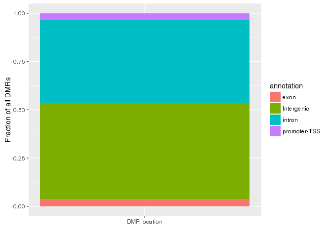
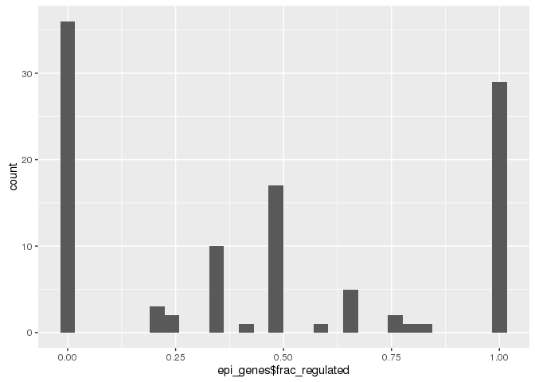
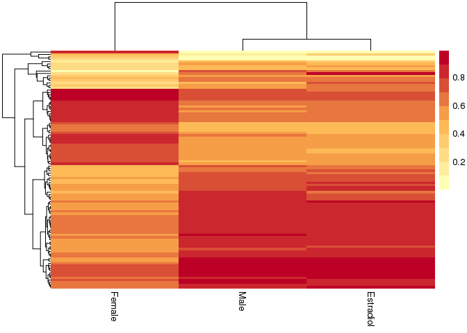
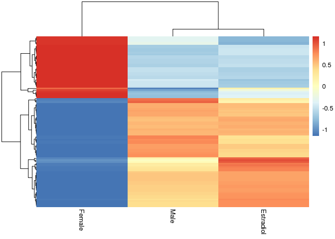

# 2-Calling_DMRs.Rmd
Tony  
February 18, 2016  


```r
require(data.table)
require(foreach)
require(doMC)
require(GenomicRanges)
require(bsseq)
require(ggplot2)
require(tidyr)
require(knitr)
require(pheatmap)
require(dplyr)
```

# Merge data


```r
load("../methylation_data/cpg_files_merged.RData")

bssmooth_cpgs <- lapply(cpg_files_merged, function(x) {
  tmp <- x %>% select(chr, pos) %>% filter(pos >0)
}) %>% rbindlist() %>% unique

registerDoMC(length(cpg_files_merged))
bssmooth <- foreach(f=names(cpg_files_merged), .combine = cbind) %dopar% {
  tmp <- cpg_files_merged[[f]] %>% setnames(c("chr", "pos", paste0(f, "_meth"), paste0(f, "_cov"))) %>% data.table()
  left_join(bssmooth_cpgs, tmp, by = c("chr","pos")) %>% select(-chr,-pos)
} %>% cbind(bssmooth_cpgs, .)

bssmooth[is.na(bssmooth)] <- 0

samples <- names(cpg_files_merged)

rm(bssmooth_cpgs)

bssmooth_smooth <- BSseq(chr = bssmooth$chr, pos = bssmooth$pos, 
                         M = bssmooth %>% select(contains("meth")) %>% as.matrix(), 
                         Cov = bssmooth %>% select(contains("cov")) %>% as.matrix(),
                         sampleNames = samples)

chroms <- granges(bssmooth_smooth) %>% seqnames %>% levels

# rm(bssmooth)

bssmooth_smooth <- BSmooth(bssmooth_smooth, verbose = TRUE, parallelBy = "chromosome", mc.cores = length(chroms))

pData(bssmooth_smooth)$col <- c("#7fc97f","#beaed4","#fdc086")

# save(... = bssmooth_smooth, file = "../methylation_data/bssmooth_smooth.RData", compress = T)
```


```r
samples <- pData(bssmooth_smooth) %>% rownames %>% gsub("_meth_cov", "", x = .)

bssmooth_dt <- cbind(
  as.data.frame(granges(bssmooth_smooth)) %>% setnames(colnames(.[1]), "chr"),
  getMeth(bssmooth_smooth) %>% as.data.frame() %>% setnames(paste0(samples, "_meth")),
  getCoverage(bssmooth_smooth) %>% as.data.frame() %>% setnames(paste0(samples, "_cov"))
) %>% data.table() %>% select(-end, -width, -strand)

save(bssmooth_smooth, bssmooth_dt, file = "../methylation_data/bssmooth_smooth.RData", compress = F)
# load("bssmooth_smooth.RData")
```

# Call DMRs for female vs male


```r
load("/projects/epigenomics/users/thui/stat540/methylation_data/bssmooth_smooth.RData")

rn6_genes <- fread("../methylation_data/homer/rn6_tss_raw.gtf", skip = 1) %>%
  select(nearest.promoter = V1, name = V7) %>% as.data.frame() %>% tbl_df() 
```


```r
bssmooth_dt_maleVsFemale <- bssmooth_dt %>%
  tbl_df() %>%
  select(-contains("estradiol")) %>%
  # filter(female_cov > 0, male_cov > 0) %>%
  mutate(diff = female_meth - male_meth)
```


```r
top_percent <- 1

# summary(bssmooth_dt_maleVsFemale$diff)
diff_quantile <- quantile(x = bssmooth_dt_maleVsFemale$diff, probs = c(top_percent/100/2, 1-(top_percent/100/2)))
diff_quantile
```

```
##       0.5%      99.5% 
## -0.1876567  0.1935138
```

```r
# ggplot(bssmooth_dt_maleVsFemale, aes(diff)) +
#   geom_density() +
#   geom_vline(xintercept = diff_quantile)
```


```r
binsize <- 500
min_cpg <- 3

bssmooth_dt_maleVsFemale_dCPG <- bssmooth_dt_maleVsFemale %>%
  filter(diff < diff_quantile[1] | diff > diff_quantile[2]) %>%
  group_by(chr) %>%
  mutate(dist = c(binsize+1,diff(start)),
         diff_cumul = diff*lag(diff, n = 1)) %>%
  ungroup() %>% mutate(chr = as.character(chr)) %>%
  mutate(bin = 1+cumsum(dist > binsize | diff_cumul < 0 | is.na(diff_cumul))) %>%
  setnames(colnames(.)[2], "pos")

bssmooth_dt_maleVsFemale_DMR <- bssmooth_dt_maleVsFemale_dCPG %>%
  filter(female_cov > 0) %>%
  group_by(chr, bin) %>%
  summarize(start=min(pos),
            end=max(pos), 
            mean_female = mean(female_meth) %>% round(3), 
            mean_male = mean(male_meth) %>% round(3),
            female_cov = sum(female_cov),
            male_cov = sum(male_cov),
            # remove DMRs within transition zones
            slope_clusters = min(
              abs(female_meth[1] - female_meth[n()]),
              abs(male_meth[1] - male_meth[n()])
              ),
            num_cpg = n()
            ) %>%
  filter(num_cpg >= min_cpg) %>%
  filter(slope_clusters < 0.1) %>%
  # filter(female_cov >= 3) %>%
  select(-slope_clusters, -num_cpg)
```

There are 16308 DMRs

## Annotate DMRs


```r
# save(bssmooth_dt_maleVsFemale_DMR, file = "methylation_data/maleVSfemaleDMRs.RData")
write.csv(x = bssmooth_dt_maleVsFemale_DMR, file = "../methylation_data/maleVSfemaleDMRs.csv", quote = F, row.names = F)

write.table(x = bssmooth_dt_maleVsFemale_DMR %>% select(bin,chr,start,end) %>% mutate(strand = "+"), file = "../methylation_data/homer/maleVSfemaleDMRs.bed", quote = F, row.names = F, col.names = F, sep = "\t")

system("cd ../methylation_data/homer; sh get_DE_tss.sh")
system("cd ../methylation_data/homer; sh homer_annotate.sh maleVSfemaleDMRs.bed")
```


```r
bssmooth_dt_maleVsFemale_DMR_annotated <- read.table("../methylation_data/homer/maleVSfemaleDMRs.bed.annotated", header = T, sep = "\t", quote="")

bssmooth_dt_maleVsFemale_DMR_annotated <- bssmooth_dt_maleVsFemale_DMR_annotated %>%
  select(1:11) %>%
  setnames(c("bin", "chr", "start", "end", "strand", "score", "ratio", "annotation", "detailed.annotation", "dist.to.tss", "nearest.promoter")) %>%
  left_join(., bssmooth_dt_maleVsFemale_DMR) %>%
  tbl_df()
```

```
## Joining by: c("bin", "chr", "start", "end")
```

```
## Warning in left_join_impl(x, y, by$x, by$y): joining character vector and
## factor, coercing into character vector
```

```r
maleVsFemale_DMR_genes <- inner_join(bssmooth_dt_maleVsFemale_DMR_annotated, rn6_genes) %>%
  select(chr, start, end, mean_female, mean_male, annotation, dist.to.tss, nearest.promoter, name, bin)
```

```
## Joining by: "nearest.promoter"
```

```
## Warning in inner_join_impl(x, y, by$x, by$y): joining factor and character
## vector, coercing into character vector
```

### Remove irrelevant DMRs

* Remove DMRs that are promoters of other genes
* Remove DMRs that are > 150000 bp away from nearest promoter


```r
maleVsFemale_DMR_genes_filtered <- maleVsFemale_DMR_genes %>%
  filter(chr != "chrY") %>%
  arrange(chr, start) %>%
  mutate(annotation = gsub("\\(.*", "", annotation) %>% gsub(" ", "", .)) %>%
  filter(abs(dist.to.tss) < 150000) %>%
  filter(ifelse(grepl("promoter-TSS", annotation), abs(dist.to.tss) < 3000, TRUE))

ggplot(maleVsFemale_DMR_genes_filtered, aes("DMR location", fill = annotation)) +
  geom_bar(position = position_fill()) +
  ylab("Fraction of all DMRs") +
  xlab("")
```



```r
head(maleVsFemale_DMR_genes_filtered) %>% kable("markdown")
```


|chr  |    start|      end| mean_female| mean_male|annotation | dist.to.tss|nearest.promoter     |name         | bin|
|:----|--------:|--------:|-----------:|---------:|:----------|-----------:|:--------------------|:------------|---:|
|chr1 | 11898931| 11900042|       0.952|     0.732|Intergenic |      -64348|ENSRNOT00000074325.1 |LOC100909555 | 154|
|chr1 | 11909558| 11909590|       0.818|     0.615|Intergenic |      -54260|ENSRNOT00000074325.1 |LOC100909555 | 155|
|chr1 | 72802651| 72803270|       0.830|     0.589|Intergenic |      -86316|ENSRNOT00000034957.6 |Tnnt1        | 835|
|chr1 | 72804700| 72805125|       0.574|     0.310|Intergenic |      -84364|ENSRNOT00000034957.6 |Tnnt1        | 836|
|chr1 | 78449242| 78449805|       0.765|     0.566|Intergenic |       72476|ENSRNOT00000021223.4 |Arhgap35     | 914|
|chr1 | 80068877| 80069226|       0.924|     0.696|intron     |        4172|ENSRNOT00000021456.2 |Gipr         | 946|

## Grab DMRs that are likely to ge epigenetically regulating


```r
de_genes <- read.table("../Data_Analysis/RNAseq_result/DE_genes/glmQLFit_DE_genes.tsv", header = TRUE)

dmr_set <- maleVsFemale_DMR_genes_filtered %>%
  mutate(hypo_in_female = mean_female < mean_male) %>%
  select(chr, start, end, annotation, dist.to.tss, gene = nearest.promoter, name, hypo_in_female) %>%
  left_join(., de_genes, by = "gene") %>%
  mutate(epi_regulation = hypo_in_female == gExp_up_in_female) %>%
  select(-V7)
```

```
## Warning in left_join_impl(x, y, by$x, by$y): joining factor and character
## vector, coercing into character vector
```

```r
table(dmr_set$epi_regulation)
```

```
## 
## FALSE  TRUE 
##   139   128
```

```r
epi_genes <- dmr_set %>%
  group_by(gene, epi_regulation) %>%
  tally() %>%
  spread(key = epi_regulation, value = n, fill = 0) %>%
  setnames(c("gene", "non_epi_regulated", "epi_regulated")) %>%
  mutate(frac_regulated = epi_regulated/(epi_regulated+non_epi_regulated))

epi_gene_list <- epi_genes %>%
  filter(frac_regulated >= 0.5) %>%
  .$gene

qplot(epi_genes$frac_regulated)
```

```
## `stat_bin()` using `bins = 30`. Pick better value with `binwidth`.
```



```r
final_table <- dmr_set %>% 
  # filter(gene %in% epi_gene_list) %>%
  filter(epi_regulation)

head(final_table) %>% kable("markdown")
```


|chr  |     start|       end|annotation   | dist.to.tss|gene                 |name         |hypo_in_female |  logFC|   FDR|gExp_up_in_female |epi_regulation |
|:----|---------:|---------:|:------------|-----------:|:--------------------|:------------|:--------------|------:|-----:|:-----------------|:--------------|
|chr1 |  11898931|  11900042|Intergenic   |      -64348|ENSRNOT00000074325.1 |LOC100909555 |FALSE          |  1.140| 0.000|FALSE             |TRUE           |
|chr1 |  11909558|  11909590|Intergenic   |      -54260|ENSRNOT00000074325.1 |LOC100909555 |FALSE          |  1.140| 0.000|FALSE             |TRUE           |
|chr1 |  78449242|  78449805|Intergenic   |       72476|ENSRNOT00000021223.4 |Arhgap35     |FALSE          |  2.151| 0.000|FALSE             |TRUE           |
|chr1 |  80072086|  80073449|promoter-TSS |         456|ENSRNOT00000021456.2 |Gipr         |TRUE           | -0.739| 0.002|TRUE              |TRUE           |
|chr1 | 174366200| 174366551|intron       |       44766|ENSRNOT00000065288.1 |Nrip3        |TRUE           | -0.444| 0.015|TRUE              |TRUE           |
|chr1 | 198124288| 198124929|exon         |      108607|ENSRNOT00000087928.1 |Aldoa        |TRUE           | -0.651| 0.000|TRUE              |TRUE           |

```r
write.table(final_table, file = "2_genes_DMR_associations.tsv", row.names = F, quote = F, sep = "\t")
```

# Now, the same but for female vs female+ estradiol


```r
bssmooth_dt_FemaleVsEstradiol <- bssmooth_dt %>%
  tbl_df() %>%
  select(-starts_with("male")) %>%
  mutate(diff = female_meth - estradiol_meth)
```


```r
top_percent <- 1

# summary(bssmooth_dt_maleVsFemale$diff)
diff_quantile <- quantile(x = bssmooth_dt_FemaleVsEstradiol$diff, probs = c(top_percent/100/2, 1-(top_percent/100/2)))
diff_quantile
```

```
##       0.5%      99.5% 
## -0.1992926  0.1906262
```

```r
# ggplot(bssmooth_dt_maleVsFemale, aes(diff)) +
#   geom_density() +
#   geom_vline(xintercept = diff_quantile)
```


```r
bssmooth_dt_FemaleVsEstradiol_dCPG <- bssmooth_dt_FemaleVsEstradiol %>%
  filter(diff < diff_quantile[1] | diff > diff_quantile[2]) %>%
  group_by(chr) %>%
  mutate(dist = c(binsize+1,diff(start)),
         diff_cumul = diff*lag(diff, n = 1)) %>%
  ungroup() %>% mutate(chr = as.character(chr)) %>%
  mutate(bin = 1+cumsum(dist > binsize | diff_cumul < 0 | is.na(diff_cumul))) %>%
  setnames(colnames(.)[2], "pos")

bssmooth_dt_FemaleVsEstradiol_DMR <- bssmooth_dt_FemaleVsEstradiol_dCPG %>%
  # filter(female_cov > 0) %>%
  # filter(bin == 2) %>%
  group_by(chr, bin) %>%
  summarise(start = min(pos), end = max(pos)+2, 
            mean_female = mean(female_meth) %>% round(3), 
            mean_estradiol = mean(estradiol_meth) %>% round(3),
            female_cov = sum(female_cov),
            estradiol_cov = sum(estradiol_cov),
            # remove DMRs within transition zones
            slope_clusters = min(
              abs(female_meth[1] - female_meth[n()]),
              abs(estradiol_meth[1] - estradiol_meth[n()])
              ),
            num_cpg = n()
            ) %>%
  filter(num_cpg >= min_cpg) %>%
  select(-slope_clusters, -num_cpg)
```

There are 21465 DMRs between female and estradiol

## Subset DMRs that are overlapping DMRs between male and female

* also within 150000 of nearest DE gene


```r
#maleVsFemale_DMR_genes_filtered
#final_table

bssmooth_dt_maleVsFemale_DMR_GRanges <- maleVsFemale_DMR_genes_filtered %>%
  makeGRangesFromDataFrame(keep.extra.columns = F)

bssmooth_dt_FemaleVsEstradiol_DMR_GRanges <- bssmooth_dt_FemaleVsEstradiol_DMR %>%
  makeGRangesFromDataFrame(keep.extra.columns = F)

overlaps <- findOverlaps(bssmooth_dt_maleVsFemale_DMR_GRanges, bssmooth_dt_FemaleVsEstradiol_DMR_GRanges, select = "all")

bssmooth_dt_FemaleVsEstradiol_DMR_overlap <- bssmooth_dt_FemaleVsEstradiol_DMR[subjectHits(overlaps),] %>% 
  arrange(chr, start) %>% filter(chr != "chrY") %>%
  mutate(hypo_in_female = mean_female < mean_estradiol)

bsmooth_dt_all_DMR_overlap <- (maleVsFemale_DMR_genes_filtered %>% arrange(chr, start))[queryHits(overlaps),] %>% filter(chr != "chrY")

bsmooth_dt_all_DMR_overlap$mean_estradiol <- bssmooth_dt_FemaleVsEstradiol_DMR_overlap$mean_estradiol
```

There are 100 DMRs between femaleVSfemale+zeb that overlap with the 267 femaleVSmale DMRs close to DE genes.

### Heatmap of these DMRs

*color represents fractional methylation of these regions*


```r
heatmap <- bsmooth_dt_all_DMR_overlap %>%
  select(starts_with("mean")) %>%
  setnames(c("Female", "Male", "Estradiol")) %>%
  data.matrix() 

heatmap %>%
  pheatmap(color = colorRampPalette(c("#ffffb2", "#feb24c", "#bd0026"))(10))
```



```r
heatmap %>%
  pheatmap(scale = "row")
```




```r
tabulate <- bsmooth_dt_all_DMR_overlap %>%
  mutate(hypo_in_femaleVSmale = mean_female < mean_male, 
         hypo_in_femaleVSestradiol = mean_female < mean_estradiol)

table(tabulate$hypo_in_femaleVSmale == tabulate$hypo_in_femaleVSestradiol)
```

```
## 
## TRUE 
##  100
```

```r
head(tabulate) %>% kable("markdown")
```


|chr  |     start|       end| mean_female| mean_male|annotation   | dist.to.tss|nearest.promoter     |name      |  bin| mean_estradiol|hypo_in_femaleVSmale |hypo_in_femaleVSestradiol |
|:----|---------:|---------:|-----------:|---------:|:------------|-----------:|:--------------------|:---------|----:|--------------:|:--------------------|:-------------------------|
|chr1 |  80072086|  80073449|       0.598|     0.873|promoter-TSS |         456|ENSRNOT00000021456.2 |Gipr      |  947|          0.840|TRUE                 |TRUE                      |
|chr1 |  91447247|  91448725|       0.009|     0.731|intron       |      140623|ENSRNOT00000050931.3 |LOC687679 | 1126|          0.650|TRUE                 |TRUE                      |
|chr1 | 198229110| 198230411|       0.522|     0.794|exon         |        3455|ENSRNOT00000087928.1 |Aldoa     | 2253|          0.707|TRUE                 |TRUE                      |
|chr1 | 224977554| 224978112|       0.564|     0.789|intron       |       43915|ENSRNOT00000066823.2 |Wdr74     | 2542|          0.865|TRUE                 |TRUE                      |
|chr1 | 231599673| 231600550|       0.687|     0.883|Intergenic   |      -69325|ENSRNOT00000018272.8 |Tle4      | 2598|          0.885|TRUE                 |TRUE                      |
|chr1 | 252722643| 252723888|       0.523|     0.870|Intergenic   |      126491|ENSRNOT00000025845.4 |Lipa      | 2822|          0.846|TRUE                 |TRUE                      |

Within the 100 regions, **all except 1** of the methylation of male and estradiol are the same, and are different compared to female. This is good, because there isn't any filtering - they just happened to end up this way.

## Look at DMRs that are potentially epigenetically regulating


```r
# bsmooth_dt_all_DMR_overlap_final %>% head %>% kable("markdown")

final_DE_genes <- read.table(file = "../Data_Analysis/RNAseq_result/DE_genes/3.1-femVSfemZeb_glmQLFit_DE_genes.tsv", header=TRUE) %>%
  select(gene, name)

bsmooth_dt_all_DMR_overlap_final <- bsmooth_dt_all_DMR_overlap %>%
  inner_join(., final_table) %>%
  select(chr, start, end, annotation, dist.to.tss, gene = nearest.promoter, name, hypo_in_femaleVSall = hypo_in_female, gExp_up_in_femaleVSmale = gExp_up_in_female) %>%
  left_join(., final_DE_genes %>% mutate(deVSall = TRUE)) %>%
  filter(hypo_in_femaleVSall == gExp_up_in_femaleVSmale) %>%
  mutate(deVSall = !(is.na(deVSall)))
```

```
## Joining by: c("chr", "start", "end", "annotation", "dist.to.tss", "name")
```

```
## Joining by: c("gene", "name")
```

```
## Warning in left_join_impl(x, y, by$x, by$y): joining factor and character
## vector, coercing into character vector

## Warning in left_join_impl(x, y, by$x, by$y): joining factor and character
## vector, coercing into character vector
```

```r
rn6_de_genes_track <- fread("../methylation_data/homer/rn6_tss_raw.gtf", skip = 1) %>%
  # filter(V1 %in% final_DE_genes$gene) %>%
  filter(V1 %in% (bssmooth_dt_maleVsFemale_DMR_annotated$nearest.promoter %>% as.character %>% unique)) %>%
  select(chr = V2, start = V4, end = V5, gene = V1)

rn6_genes_track <- fread("../methylation_data/homer/rn6_tss_raw.gtf", skip = 1) %>%
  select(chr = V2, start = V4, end = V5, strand = V3, gene = V1) %>%
  filter(chr %in% rn6_de_genes_track$chr)

x <- table(bsmooth_dt_all_DMR_overlap_final$deVSall)

bsmooth_dt_all_DMR_overlap_final %>% head %>% kable("markdown")
```


|chr   |     start|       end|annotation   | dist.to.tss|gene                 |name         |hypo_in_femaleVSall |gExp_up_in_femaleVSmale |deVSall |
|:-----|---------:|---------:|:------------|-----------:|:--------------------|:------------|:-------------------|:-----------------------|:-------|
|chr1  |  80072086|  80073449|promoter-TSS |         456|ENSRNOT00000021456.2 |Gipr         |TRUE                |TRUE                    |TRUE    |
|chr1  | 198229110| 198230411|exon         |        3455|ENSRNOT00000087928.1 |Aldoa        |TRUE                |TRUE                    |FALSE   |
|chr1  | 252722643| 252723888|Intergenic   |      126491|ENSRNOT00000025845.4 |Lipa         |TRUE                |TRUE                    |FALSE   |
|chr1  | 252724577| 252725416|Intergenic   |      124760|ENSRNOT00000025845.4 |Lipa         |TRUE                |TRUE                    |FALSE   |
|chr10 |  38140754|  38142542|intron       |     -116711|ENSRNOT00000042688.2 |LOC100362027 |TRUE                |TRUE                    |TRUE    |
|chr10 |  46594075|  46594169|promoter-TSS |       -1113|ENSRNOT00000047053.6 |Srebf1       |TRUE                |TRUE                    |FALSE   |

There are 13 regions that associated with genes that are DE in all conditions, and 42 regions that only associated with genes that are DE between male and female (`deVSall` column)


```r
final_DMR_set <- bsmooth_dt_all_DMR_overlap_final %>%
  filter(annotation != "intron", annotation != "exon") %>%
  filter(abs(dist.to.tss) < 150000)

write.table(bsmooth_dt_all_DMR_overlap_final, file = "../methylation_data/3-all_gene_associated_DMRs.tsv", row.names = F, quote = F, sep = "\t")
```


```r
rn6_promoters <- rn6_genes_track %>%
  makeGRangesFromDataFrame(keep.extra.columns = T) %>%
  promoters(upstream = 2000, downstream = 2000) %>%
  as.data.frame() %>%
  dplyr::rename(chr = seqnames)

final_DMR_set_visualize <- bsmooth_dt_all_DMR_overlap_final %>%
  filter(deVSall) %>%
  left_join(., rn6_promoters, by = "gene") %>%
  mutate(start = pmin(start.x, start.y),
         end = pmax(end.x, end.y))

bsmooth_dt_all_DMR_overlap_final %>%
  filter(deVSall) %>%
  write.table(file = "../methylation_data/3-DE_gene_associated_DMRs.tsv", row.names = F, quote = F, sep = "\t")
```


```r
regions_final_DMR_set <- makeGRangesFromDataFrame(final_DMR_set_visualize, seqnames.field = "chr.x", keep.extra.columns = T)

pdf("../methylation_data/2-final_DMR_plots_allDE.pdf")
for (i in seq_along(regions_final_DMR_set)) {
  title <- paste("Transcript", regions_final_DMR_set$gene[i], "for gene", regions_final_DMR_set$name[i])
  plotRegion(BSseq = bssmooth_smooth, region = regions_final_DMR_set[i], extend = 10000, addRegions = makeGRangesFromDataFrame(bsmooth_dt_all_DMR_overlap_final), main = title,
             annoTrack = list(
               de = makeGRangesFromDataFrame(rn6_de_genes_track),
               genes= makeGRangesFromDataFrame(rn6_genes_track)
             ))
}
dev.off()
```


```r
save.image("../Data_Analysis/2-DMRs.RData", compress = F)
```


