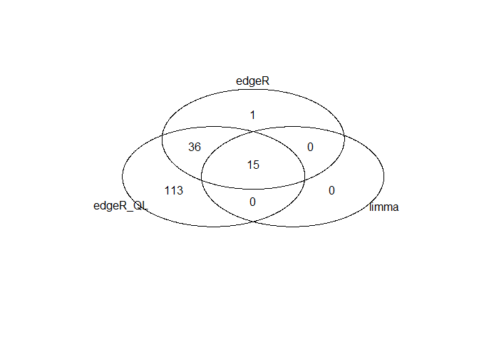
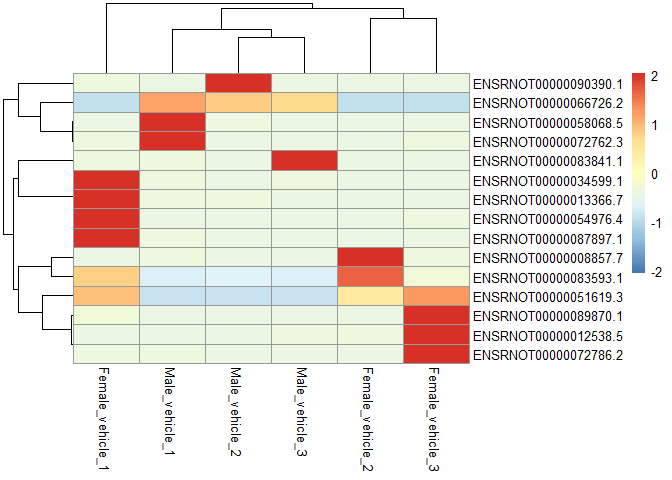

# 2-RNAseq_differential_expression
Tony Hui and Rashed  
March 8, 2016  


```r
library(NOISeq)
library(ggplot2)
require(tidyr)
require(knitr)
require(limma)
require(edgeR)
require(gplots)
require(pheatmap)
library(dplyr)
```


```r
setwd("Data_Analysis/")
```

## Load data


```r
rnaseq <- read.table(file="../RNASeq_data/new_data_Tony_TPM/RNAseq_new_merged_raw.txt", header = TRUE, stringsAsFactors = FALSE)

rnaseq_meta <- read.table(file = "../RNASeq_data/new_data_Tony_TPM/sailfish_file_table.txt", stringsAsFactors = FALSE)

colnames(rnaseq) <- with(rnaseq_meta, paste(V3, V4, rep(1:3, 3), sep = "_"))

rnaseq_meta$samples <- with(rnaseq_meta, paste(V3, V4, rep(1:3, 3), sep = "_"))
```

## Plot distribution of gExps


```r
rnaseq_male_Female <- rnaseq %>%
  add_rownames("gene") %>%
  select(gene, contains("vehicle")) %>%
  gather(key = sample, value = gExp, -gene) %>%
  mutate(gender = ifelse(grepl("Female", sample), "Female", "male"))

rnaseq_male_Female %>% 
  ggplot(aes(gExp+0.5, color = gender)) +
  geom_density() +
  scale_x_log10()
```


## Try Limma's `voom` function


```r
samples <- rnaseq_meta %>% filter(V4 == "vehicle")

limma_design_matrix <- model.matrix(~V3, samples)

rownames(limma_design_matrix) <- samples$samples

voom_DGElist <- rnaseq %>%
  select(contains("vehicle")) %>%
  DGEList(group = rep(c("f","m"), each = 3)) %>%
  .[rowSums(cpm(.) > 0.3) >= 2, , keep.lib.sizes=FALSE]

voom_rnaseq <- voom_DGElist %>%
  voom(design = limma_design_matrix, plot = T)
```


```r
fit_limma <- lmFit(object = voom_rnaseq, design = limma_design_matrix) %>% eBayes()

limma_results <- topTable(fit_limma, adjust="fdr", number = Inf)
```

```
## Removing intercept from test coefficients
```

Pvalues are skewed to the right


```r
limma_results %>% 
  ggplot(aes(P.Value)) +
  geom_density()
```


### Double-check nothing funny is going on


```r
correlation <- cor(rnaseq %>% select(contains("vehicle")), method = "spearman")

diag(correlation) <- NA

clustering <- hclust(as.dist(1-correlation), method = "ward.D2")

require(pheatmap)
pheatmap(correlation, cluster_rows = clustering, cluster_cols = clustering, display_numbers = T, color = colorRampPalette(c("#ffffb2", "#bd0026"))(9))
```


```r
plot(clustering)
```


Seems like everything is normal, although there doesn't seem to be a clear separation between male and female

## Try edgeR with usual Negative Binomial fit


```r
edgeR_DGElist <- rnaseq %>%
  select(contains("vehicle")) %>%
  DGEList(group = rep(c("f","m"), each = 3)) %>%
  .[rowSums(cpm(.) > 0.3) >= 2, , keep.lib.sizes=FALSE] %>%
  calcNormFactors()

edgeR_DGElist_trends <- edgeR_DGElist %>%
  estimateGLMCommonDisp(limma_design_matrix, verbose=TRUE) %>%
  estimateGLMTrendedDisp(limma_design_matrix) %>%
  estimateGLMTagwiseDisp(limma_design_matrix)
```

```
## Disp = 0.03377 , BCV = 0.1838
```

```r
plotBCV(edgeR_DGElist_trends)
```


```r
# plotMDS.DGEList(edgeR_DGElist_trends)
```


```r
fit <- glmFit(edgeR_DGElist_trends, limma_design_matrix) %>% glmLRT(coef = 2)

edgeR_results <- topTags(fit, n = Inf) %>% as.data.frame()

edgeR_results %>% head() %>% kable("markdown")
```


|                     |     logFC|   logCPM|        LR| PValue| FDR|
|:--------------------|---------:|--------:|---------:|------:|---:|
|ENSRNOT00000088593.1 | 14.085475| 5.053390| 1540.5503|      0|   0|
|ENSRNOT00000092078.1 | 10.345845| 4.918516| 1486.2852|      0|   0|
|ENSRNOT00000086056.1 | 10.269165| 4.841341| 1354.0319|      0|   0|
|ENSRNOT00000082648.1 | 12.237584| 3.214705|  534.3931|      0|   0|
|ENSRNOT00000075940.1 | -5.390653| 3.780268|  495.2908|      0|   0|
|ENSRNOT00000088616.1 |  6.433413| 2.887938|  347.9084|      0|   0|

Once again, right-skewed Pvalues


```r
qplot(edgeR_results$PValue, geom="density")
```


## Try edgeR with Negative Binomial quasi-likelihood(QL) fit

There is `glmFit` for the previous one and `glmQLFit` for this one which incorporates quasi-likelihood fitting. The main differences between these two are as follows:

`glmQLFit` actually addresses two type of dispersions: one is the gene-specific dispersion modeled by QL dispersion parameter and another one is the NB dispersion parameter, the global one over all genes.

"So the two dispersion parameters have different roles. The NB dispersion describes the overall biological variability across all genes. The square-root of the NB dispersion is known as the biological coefficient of variation. It represents the observed variation that is attributable to inherent variability in the biological system, in contrast to the Poisson variation from sequencing. The QL dispersion picks up any gene-specific variability above and below the overall level. " (Quoted from the reference below.) Both are incorporated in the glmQLFit. 

For full reference with more discussion you can find the reference here: [Link](http://www.statsci.org/smyth/pubs/QLedgeRPreprint.pdf) 


```r
fitQL <- glmQLFit(edgeR_DGElist_trends, limma_design_matrix) %>% glmLRT(coef = 2)

edgeR_QL_results <- topTags(fitQL, n = Inf) %>% as.data.frame()

edgeR_QL_results %>% head() %>% kable("markdown")
```


|                     |     logFC|   logCPM|        LR| PValue| FDR|
|:--------------------|---------:|--------:|---------:|------:|---:|
|ENSRNOT00000088593.1 | 14.085478| 5.053390| 1481.2323|      0|   0|
|ENSRNOT00000092078.1 | 10.345750| 4.918516| 1333.8447|      0|   0|
|ENSRNOT00000086056.1 | 10.269186| 4.841341| 1274.7826|      0|   0|
|ENSRNOT00000028064.5 | -6.819740| 3.711348|  528.2253|      0|   0|
|ENSRNOT00000082648.1 | 12.237531| 3.214705|  456.0808|      0|   0|
|ENSRNOT00000075940.1 | -5.389753| 3.780268|  445.5320|      0|   0|

Once again, right-skewed Pvalues


```r
qplot(edgeR_QL_results$PValue, geom="density")
```


## Summary of results


```
## [1] "there are 15 DE genes from limma"
```

```
## [1] "there are 164 DE genes from edgeR glmQLFit"
```

```
## [1] "there are 52 DE genes from edgeR glmFit"
```

```r
venn(list(
  edgeR_QL = edgeR_QL_results %>% subset(FDR<0.05) %>% rownames(.),
  limma = limma_results %>% subset(adj.P.Val<0.05) %>% rownames(.),
  edgeR = edgeR_results %>% subset(FDR<0.05) %>% rownames(.)
))
```



## Check for cannonical gene that should be differentially expressed


```r
rn6_gene <- read.table("../Data_Analysis/rn6_genes.txt") %>% tbl_df() %>%
  select(gene = V1, V7) %>% 
  unique()

cannonical_gene <- c("Prl", "Xist", "Dby", "Eif2s3y", "Rps4y2", "Smcy", "Uty", "Eif2s3")

rn6_gene_interest <- rn6_gene %>%
  filter(V7 %in% cannonical_gene)

rn6_gene_interest
```

```
## Source: local data frame [7 x 2]
## 
##                   gene      V7
##                 (fctr)  (fctr)
## 1 ENSRNOT00000043543.2  Rps4y2
## 2 ENSRNOT00000092019.1  Eif2s3
## 3 ENSRNOT00000082421.1  Eif2s3
## 4 ENSRNOT00000081124.1  Eif2s3
## 5 ENSRNOT00000082648.1     Uty
## 6 ENSRNOT00000088593.1 Eif2s3y
## 7 ENSRNOT00000023412.4     Prl
```


```r
right_join(rn6_gene, edgeR_QL_results %>% add_rownames("gene"), by = "gene")  %>%
  filter(gene %in% rn6_gene_interest$gene) %>% kable("markdown")
```

```
## Warning in right_join_impl(x, y, by$x, by$y): joining factor and character
## vector, coercing into character vector
```


|gene                 |V7      |      logFC|   logCPM|           LR|    PValue|       FDR|
|:--------------------|:-------|----------:|--------:|------------:|---------:|---------:|
|ENSRNOT00000088593.1 |Eif2s3y | 14.0854776| 5.053390| 1481.2322963| 0.0000000| 0.0000000|
|ENSRNOT00000082648.1 |Uty     | 12.2375307| 3.214705|  456.0808043| 0.0000000| 0.0000000|
|ENSRNOT00000092019.1 |Eif2s3  | -0.6675812| 7.769330|   48.0627248| 0.0000000| 0.0000000|
|ENSRNOT00000082421.1 |Eif2s3  | -1.2963958| 1.077961|    8.8985483| 0.0028540| 0.2480257|
|ENSRNOT00000081124.1 |Eif2s3  | -0.2888773| 3.162468|    1.4936701| 0.2216479| 0.9999732|
|ENSRNOT00000043543.2 |Rps4y2  | -0.0252202| 2.446263|    0.0075271| 0.9308630| 0.9999732|

Looks like some of cannonical genes are differentially expressed. Yay!


```r
# write.table(edgeR_QL_results %>% subset(FDR<0.05) %>% rownames(.), file = "/projects/epigenomics/users/thui/stat540/methylation_data/homer/de_transcripts.txt", row.names = F, col.names = F, quote = F)
```

```r
edge_QL_final <- edgeR_QL_results %>% subset(FDR<0.05) %>% add_rownames("gene")

edge_QL_final <- edge_QL_final %>%
  select(gene, FDR)

gExp <- 
  rnaseq %>%
  # select(contains("vehicle")) %>%
  DGEList() %>%
  calcNormFactors() %>%
  cpm() %>% 
  as.data.frame() %>%
  add_rownames("gene") %>%
  # filter(gene %in% edge_QL_final$gene) %>%
  inner_join(., edge_QL_final) %>%
  gather(key = sample, value = gExp, -gene) %>%
  mutate(group = gsub("\\_[1-9]", "", sample)) %>%
  group_by(gene, group) %>%
  summarize(mean = mean(gExp) %>% round(3)) %>%
  spread(key = group, value = mean) %>%
  ungroup() 
```

```
## Joining by: "gene"
```

```r
# write.table(gExp, file = "../Data_Analysis/RNAseq_result/DE_genes/maleVSfemale_glmQLFit_DE_genes.tsv", row.names = F, col.names = T, quote = F, sep = "\t")
```

## Compare `edgeR` with the results obtained from `NOIseq`


```r
rnaseq_samples <- rnaseq %>%select(contains("vehicle"))

noiseq_factors <- data.frame(gender = rep(c("female", "male"), each=3), row.names = colnames(rnaseq_samples))

noiseq_data <- readData(data = rnaseq_samples, factors = noiseq_factors)

noiseq_results <- noiseqbio(input = noiseq_data, factor = "gender", norm = "tmm", filter = 1)
```

```
## Computing Z values...
## Filtering out low count features...
## 25022 features are to be kept for differential expression analysis with filtering method 1
## ...k-means clustering done
## Size of 15 clusters:
##  [1]    37   525   298    85   137    19 14245   871  2570  4701     5
## [12]     9  1473    46     1
## Resampling cluster...[1] 1
## [1] 2
## [1] 3
## [1] 4
## [1] 5
## [1] 6
## [1] 7
## Size of 15 subclusters of cluster: 7
##  [1]  535   40  596  481  693  482   13 1810  136  769  502 1038 5007 1289
## [15]  854
## [1] 8
## [1] 9
## Size of 15 subclusters of cluster: 9
##  [1] 214 160 271 101  25 279 128 243  17   2 306 273 150 228 173
## [1] 10
## Size of 15 subclusters of cluster: 10
##  [1] 503 273 218 206 608 718 339 388   6 195 462 422  26   3 334
## [1] 11
## [1] 12
## [1] 13
## Size of 15 subclusters of cluster: 13
##  [1] 149  76  59 133  56  82 118  79   5  67 152  50 105 180 162
## [1] 14
## [1] 15
## Computing Z for noise...
## Computing probability of differential expression...
## p0 = 0.602640939155568
## Probability
##    Min. 1st Qu.  Median    Mean 3rd Qu.    Max.    NA's 
##   0.000   0.129   0.410   0.392   0.659   1.000    5875
```

```r
NOISeq_hits <- degenes(noiseq_results)
```

```
## [1] "45 differentially expressed features"
```

```r
DE.plot(output = noiseq_results, q = 0.95, graphic = "expr")
```


```
## [1] "45 differentially expressed features"
```

```r
x<-venn(list(
  edgeR_glmQLFit = edgeR_QL_results %>% subset(FDR<0.05) %>% rownames(.),
  NOISeq = rownames(NOISeq_hits),
  edgeR_glmFit = edgeR_results %>% subset(FDR<0.05) %>% rownames(.)
))
```


```r
x <- attr(x, "intersection")
```

## Noticed that 15 genes are only called DE in `NOISeq`

Let's take a look at these genes


```r
full_data <- rnaseq_samples %>%
  DGEList(group = rep(c("f","m"), each = 3))

cpm(full_data) %>% subset(rownames(.) %in% x$`010`) %>% round(2) %>% kable("markdown")
```


|                     | Female_vehicle_1| Female_vehicle_2| Female_vehicle_3| Male_vehicle_1| Male_vehicle_2| Male_vehicle_3|
|:--------------------|----------------:|----------------:|----------------:|--------------:|--------------:|--------------:|
|ENSRNOT00000008857.7 |             0.00|             0.50|             0.00|           0.00|           0.00|           0.00|
|ENSRNOT00000012538.5 |             0.00|             0.06|             7.45|           0.00|           0.00|           0.03|
|ENSRNOT00000013366.7 |             1.73|             0.00|             0.00|           0.00|           0.00|           0.00|
|ENSRNOT00000034599.1 |            20.07|             0.03|             0.04|           0.07|           0.03|           0.08|
|ENSRNOT00000051619.3 |             0.15|             0.12|             0.18|           0.00|           0.00|           0.00|
|ENSRNOT00000054976.4 |            47.88|             0.00|             0.00|           0.00|           0.00|           0.00|
|ENSRNOT00000058068.5 |             0.00|             0.00|             0.00|           0.68|           0.01|           0.00|
|ENSRNOT00000066726.2 |             0.00|             0.00|             0.00|           0.14|           0.11|           0.10|
|ENSRNOT00000072762.3 |             0.00|             0.00|             0.00|           3.83|           0.00|           0.00|
|ENSRNOT00000072786.2 |             0.00|             0.00|             1.64|           0.00|           0.00|           0.00|
|ENSRNOT00000083593.1 |             0.32|             0.51|             0.09|           0.00|           0.01|           0.00|
|ENSRNOT00000083841.1 |             0.00|             0.00|             0.00|           0.00|           0.00|           0.13|
|ENSRNOT00000087897.1 |             0.65|             0.00|             0.00|           0.00|           0.00|           0.00|
|ENSRNOT00000089870.1 |             0.18|             0.00|             4.04|           0.00|           0.00|           0.00|
|ENSRNOT00000090390.1 |             0.00|             0.00|             0.00|           0.00|           0.20|           0.00|

```r
cpm(full_data) %>% subset(rownames(.) %in% x$`010`) %>% pheatmap(scale = "row")
```



Basically all of them are only expressed in one sample, which may be a technical artifact. AKA these genes are no good, and shouldn't be considered. 

## Grand conclusion

We decide to proceed with `glmQLFit` since it gives the most number of genes, presumably due to highest sensitivity that we care most here for our further analysis. 
