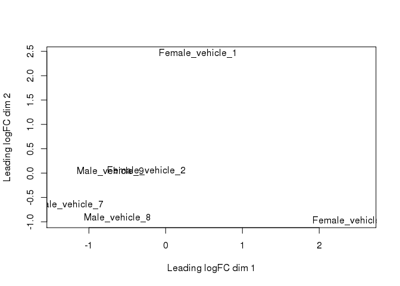
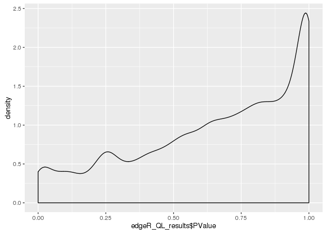
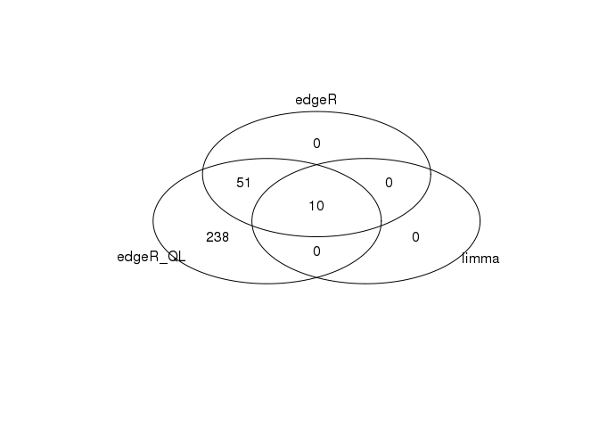

# 2-RNAseq_differential_expression
Tony Hui  
March 8, 2016  


```r
library(dplyr)
library(ggplot2)
require(tidyr)
require(knitr)
require(limma)
require(edgeR)
require(gplots)
require(pheatmap)
```


```r
setwd("Data_Analysis/")
```

## Load data


```r
rnaseq <- read.table(file="../RNASeq_data/new_data_Tony_TPM/RNAseq_new_merged_raw.txt", header = TRUE, stringsAsFactors = FALSE)

rnaseq_meta <- read.table(file = "../RNASeq_data/new_data_Tony_TPM/sailfish_file_table.txt", stringsAsFactors = FALSE)

colnames(rnaseq) <- with(rnaseq_meta, paste(V3, V4, 1:12, sep = "_"))

rnaseq_meta$samples <- with(rnaseq_meta, paste(V3, V4, 1:12, sep = "_"))
```

## Plot distribution of gExps


```r
rnaseq_male_Female <- rnaseq %>%
  add_rownames("gene") %>%
  select(gene, contains("vehicle")) %>%
  gather(key = sample, value = gExp, -gene) %>%
  mutate(gender = ifelse(grepl("Female", sample), "Female", "male"))

rnaseq_male_Female %>% 
  ggplot(aes(gExp+0.5, color = gender)) +
  geom_density() +
  scale_x_log10()
```


## Try Limma's `voom` function


```r
samples <- rnaseq_meta %>% filter(V4 == "vehicle")

limma_design_matrix <- model.matrix(~V3, samples)

rownames(limma_design_matrix) <- samples$samples

voom_rnaseq <- rnaseq %>%
  select(contains("vehicle")) %>%
  voom(design = limma_design_matrix, plot = T)
```


```r
fit <- lmFit(object = voom_rnaseq, design = limma_design_matrix) %>% eBayes()

limma_results <- topTable(fit, adjust="fdr", number = Inf)
```

```
## Removing intercept from test coefficients
```

Pvalues are skewed to the right


```r
limma_results %>% 
  ggplot(aes(P.Value)) +
  geom_density()
```


### Double-check nothing funny is going on


```r
correlation <- cor(rnaseq %>% select(contains("vehicle")), method = "spearman")

diag(correlation) <- NA

clustering <- hclust(as.dist(1-correlation), method = "ward.D2")

require(pheatmap)
pheatmap(correlation, cluster_rows = clustering, cluster_cols = clustering, display_numbers = T, color = colorRampPalette(c("#ffffb2", "#bd0026"))(9))
```


```r
plot(clustering)
```


Seems like everything is normal, although there doesn't seem to be a clear separation between male and female

## Try edgeR


```r
edgeR_DGElist <- rnaseq %>%
  select(contains("vehicle")) %>%
  DGEList(group = rep(c("f","m"), each = 3)) %>%
  calcNormFactors(method = "TMM") 

edgeR_DGElist_trends <- edgeR_DGElist %>%
  estimateGLMCommonDisp(limma_design_matrix, verbose=TRUE) %>%
  estimateGLMTrendedDisp(limma_design_matrix) %>%
  estimateGLMTagwiseDisp(limma_design_matrix)
```

```
## Disp = 0.03703 , BCV = 0.1924
```

```r
plotBCV(edgeR_DGElist_trends)
```


```r
plotMDS.DGEList(edgeR_DGElist_trends)
```



```r
fit <- glmFit(edgeR_DGElist_trends, limma_design_matrix) %>% glmLRT(coef = 2)

edgeR_results <- topTags(fit, n = Inf) %>% as.data.frame()

edgeR_results %>% head() %>% kable("markdown")
```


|                     |     logFC|   logCPM|        LR| PValue| FDR|
|:--------------------|---------:|--------:|---------:|------:|---:|
|ENSRNOT00000088593.1 | 14.084924| 5.052356| 1522.3197|      0|   0|
|ENSRNOT00000092078.1 | 10.344881| 4.917585| 1451.6402|      0|   0|
|ENSRNOT00000086056.1 | 10.268320| 4.840503| 1334.4100|      0|   0|
|ENSRNOT00000082648.1 | 12.237084| 3.213748|  535.3965|      0|   0|
|ENSRNOT00000075940.1 | -5.391451| 3.780004|  495.9766|      0|   0|
|ENSRNOT00000088616.1 |  6.432642| 2.887048|  350.2675|      0|   0|

Once again, right-skewed Pvalues


```r
qplot(edgeR_results$PValue, geom="density")
```


## Try edgeR with quasilinear fit

There is `glmFit` and `glmQLFit` - not sure the difference

Reference here: http://www.statsci.org/smyth/pubs/QLedgeRPreprint.pdf


```r
fitQL <- glmQLFit(edgeR_DGElist_trends, limma_design_matrix) %>% glmLRT(coef = 2)

edgeR_QL_results <- topTags(fitQL, n = Inf) %>% as.data.frame()

edgeR_QL_results %>% head() %>% kable("markdown")
```


|                     |      logFC|   logCPM|        LR| PValue| FDR|
|:--------------------|----------:|--------:|---------:|------:|---:|
|ENSRNOT00000088593.1 |  14.084931| 5.052356| 1308.3694|      0|   0|
|ENSRNOT00000092078.1 |  10.344666| 4.917585| 1158.9505|      0|   0|
|ENSRNOT00000086056.1 |  10.268392| 4.840503| 1101.6075|      0|   0|
|ENSRNOT00000028064.5 |  -6.820138| 3.710364|  499.9378|      0|   0|
|ENSRNOT00000082648.1 |  12.237044| 3.213748|  477.0839|      0|   0|
|ENSRNOT00000054976.4 | -12.016664| 3.006216|  445.4413|      0|   0|

Once again, right-skewed Pvalues


```r
qplot(edgeR_QL_results$PValue, geom="density")
```



## Summary of results


```
## [1] "there are 10 DE genes from limma"
```

```
## [1] "there are 299 DE genes from edgeR glmQLFit"
```

```
## [1] "there are 61 DE genes from edgeR glmFit"
```

```r
venn(list(
  edgeR_QL = edgeR_QL_results %>% subset(FDR<0.05) %>% rownames(.),
  limma = limma_results %>% subset(adj.P.Val<0.05) %>% rownames(.),
  edgeR = edgeR_results %>% subset(FDR<0.05) %>% rownames(.)
))
```



## Check for cannonical gene that should be differentially expressed


```r
rn6_gene <- read.table("../Data_Analysis/rn6_genes.txt") %>% tbl_df() %>%
  select(gene = V1, V7) %>% 
  unique()

cannonical_gene <- c("Prl", "Xist", "Dby", "Eif2s3y", "Rps4y2", "Smcy", "Uty", "Eif2s3")

rn6_gene_interest <- rn6_gene %>%
  filter(V7 %in% cannonical_gene)

rn6_gene_interest
```

```
## Source: local data frame [7 x 2]
## 
##                   gene      V7
##                 (fctr)  (fctr)
## 1 ENSRNOT00000043543.2  Rps4y2
## 2 ENSRNOT00000092019.1  Eif2s3
## 3 ENSRNOT00000082421.1  Eif2s3
## 4 ENSRNOT00000081124.1  Eif2s3
## 5 ENSRNOT00000082648.1     Uty
## 6 ENSRNOT00000088593.1 Eif2s3y
## 7 ENSRNOT00000023412.4     Prl
```


```r
right_join(rn6_gene, edgeR_results %>% add_rownames("gene"), by = "gene")  %>%
  filter(gene %in% rn6_gene_interest$gene) %>% kable("markdown")
```

```
## Warning in right_join_impl(x, y, by$x, by$y): joining factor and character
## vector, coercing into character vector
```


|gene                 |V7      |      logFC|    logCPM|           LR|    PValue|       FDR|
|:--------------------|:-------|----------:|---------:|------------:|---------:|---------:|
|ENSRNOT00000088593.1 |Eif2s3y | 14.0849243|  5.052356| 1522.3196810| 0.0000000| 0.0000000|
|ENSRNOT00000082648.1 |Uty     | 12.2370844|  3.213748|  535.3964813| 0.0000000| 0.0000000|
|ENSRNOT00000092019.1 |Eif2s3  | -0.6685926|  7.768833|   60.4312632| 0.0000000| 0.0000000|
|ENSRNOT00000082421.1 |Eif2s3  | -1.2990460|  1.077635|    7.5110934| 0.0061320| 0.6555738|
|ENSRNOT00000081124.1 |Eif2s3  | -0.2894436|  3.161998|    2.0916644| 0.1481046| 1.0000000|
|ENSRNOT00000023412.4 |Prl     | -1.9171102| -3.920518|    1.4054463| 0.2358138| 1.0000000|
|ENSRNOT00000043543.2 |Rps4y2  | -0.0269466|  2.445583|    0.0081392| 0.9281144| 1.0000000|

Looks like some of cannonical genes are differentially expressed. Yay!


```r
write.table(edgeR_QL_results %>% subset(FDR<0.05) %>% rownames(.), file = "/projects/epigenomics/users/thui/stat540/methylation_data/homer/de_transcripts.txt", row.names = F, col.names = F, quote = F)
```

```r
edge_QL_final <- edgeR_QL_results %>% subset(FDR<0.05) %>% add_rownames("gene")

output_results <- rnaseq_male_Female %>% 
  filter(gene %in% edge_QL_final$gene) %>%
  # head(100) %>%
  group_by(gene, gender) %>%
  summarize(log_mean_exp = mean(gExp) %>% round(digits = 2)) %>%
  spread(key = gender, value = log_mean_exp) %>%
  inner_join(., edge_QL_final) %>%
  mutate(gExp_up_in_female = Female > male) %>%
  select(-LR, -logCPM, -Female, -male, -PValue) %>%
  inner_join(., rn6_gene) %>%
  mutate(logFC = round(logFC, 3),
         FDR = round (FDR, 3))
```

```
## Joining by: "gene"
## Joining by: "gene"
```

```
## Warning in inner_join_impl(x, y, by$x, by$y): joining character vector and
## factor, coercing into character vector
```

```r
write.table(output_results, file = "../Data_Analysis/RNAseq_result/DE_genes/glmQLFit_DE_genes.tsv", row.names = F, col.names = T, quote = F, sep = "\t")
```

## Compare vs NOIse-seq


```r
noise_degenes <- read.table("../Data_Analysis/RNAseq_result/DE_genes/noise_seq_DEgenes.txt", header = T)
```

```r
venn(list(
  edgeR_QL = edgeR_QL_results %>% subset(FDR<0.05) %>% rownames(.),
  noiseSeq = noise_degenes$gene,
  edgeR = edgeR_results %>% subset(FDR<0.05) %>% rownames(.)
))
```


