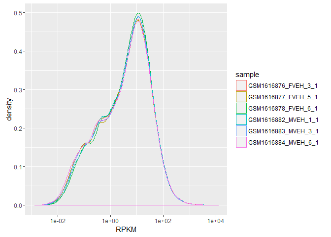

# 2-RNAseq_differential_expression
Tony Hui  
March 8, 2016  


```r
library(dplyr)
library(ggplot2)
require(tidyr)
require(knitr)
```

## Load data


```r
rnaseq <- read.table(file="../RNASeq_data/RNAseq_all_merged.txt", header = TRUE, stringsAsFactors = FALSE) %>% tbl_df()
```

## Plot distribution of RPKMs


```r
rnaseq_male_female <- rnaseq %>%
  select(genes, contains("FVEH"), contains("MVEH")) %>%
  gather(key = sample, value = RPKM, -genes) %>%
  mutate(group = ifelse(grepl("FVEH", sample), "female", "male"))

rnaseq_male_female %>% 
  ggplot(aes(RPKM, color = sample)) +
  geom_density() +
  scale_x_log10()
```

```
## Warning: Removed 57394 rows containing non-finite values (stat_density).
```



Set a cutoff RPKM; anything less than this value will be adjusted to become this value.

Also, since the distribution is not normal, need to log transform first before performing further calculations

## T-test


```r
cutoff = 0.1

paste("set RPKM cutoff at", cutoff)
```

```
## [1] "set RPKM cutoff at 0.1"
```

```r
rnaseq_male_female_cutoff <- rnaseq_male_female %>%
  mutate(RPKM = ifelse(RPKM < cutoff, cutoff, RPKM)) %>%
  mutate(log_RPKM = log(RPKM, 10)) %>%
  group_by(genes) %>%
  # remove genes with no variation across samples
  filter(sd(RPKM) > 0) %>%
  ungroup()

rnaseq_male_female_ttest <- rnaseq_male_female_cutoff %>%
  group_by(genes) %>%
  summarize(
    log_female_mean = t.test(log_RPKM[group == "female"], log_RPKM[group != "female"])$estimate[1],
    log_male_mean = t.test(log_RPKM[group == "female"], log_RPKM[group != "female"])$estimate[2],
    pvalue = t.test(log_RPKM[group == "female"], log_RPKM[group != "female"], var.equal = TRUE)$p.value
    ) 

rnaseq_male_female_ttest_corrected <- rnaseq_male_female_ttest %>%
  mutate(log2_fold_change = 10^(log_female_mean - log_male_mean) %>% log(2)) %>%
  mutate(fdr = p.adjust(pvalue, method = "fdr")) %>%
  arrange((fdr))
```

### FDR correction destroys Pvalues


```r
ggplot(rnaseq_male_female_ttest_corrected) +
  geom_density(aes(pvalue, color = "pvalue")) + 
  geom_density(aes(fdr, color = "fdr")) +
  scale_x_log10(limits = c(0.01, 1))
```

```
## Warning: Removed 128 rows containing non-finite values (stat_density).
```


Only 1 genes with fdr < 0.05

### filter on fold-change and raw pvalue instead

This method increases sensitivity at cost of false positive rate

#### Distribution of log2 fold changes

Need to decide what cutoff to use


```r
sd_fc <- sd(rnaseq_male_female_ttest_corrected$log2_fold_change)
paste("sd of fold change is", sd_fc %>% round(2))
```

```
## [1] "sd of fold change is 0.35"
```

```r
ggplot(rnaseq_male_female_ttest_corrected, aes(log2_fold_change)) +
  geom_density() +
  geom_vline(xintercept = c(sd_fc*2, -sd_fc*2))
```


Choose 2 standard deviations away and have pvalue < 0.01


```r
sig_genes <- rnaseq_male_female_ttest_corrected %>% filter(abs(log2_fold_change) > sd_fc*2, pvalue < 0.01) %>% arrange(pvalue)
```

This results in 53 genes


```r
sig_genes %>% head %>% kable("markdown")
```


|genes              | log_female_mean| log_male_mean|    pvalue| log2_fold_change|       fdr|
|:------------------|---------------:|-------------:|---------:|----------------:|---------:|
|ENSRNOG00000037911 |       1.7005229|    -0.8363176| 0.0000005|         8.427202| 0.0109225|
|ENSRNOG00000035669 |      -0.2829399|    -1.0000000| 0.0000174|         2.382022| 0.1180619|
|ENSRNOG00000036218 |      -0.5014350|    -1.0000000| 0.0000737|         1.656197| 0.2994648|
|ENSRNOG00000032173 |      -0.5596067|    -1.0000000| 0.0001109|         1.462955| 0.3757370|
|ENSRNOG00000044222 |      -1.0000000|    -0.5732005| 0.0002285|        -1.417797| 0.5804352|
|ENSRNOG00000035486 |      -1.0000000|    -0.2677785| 0.0004333|        -2.432387| 0.7827548|
